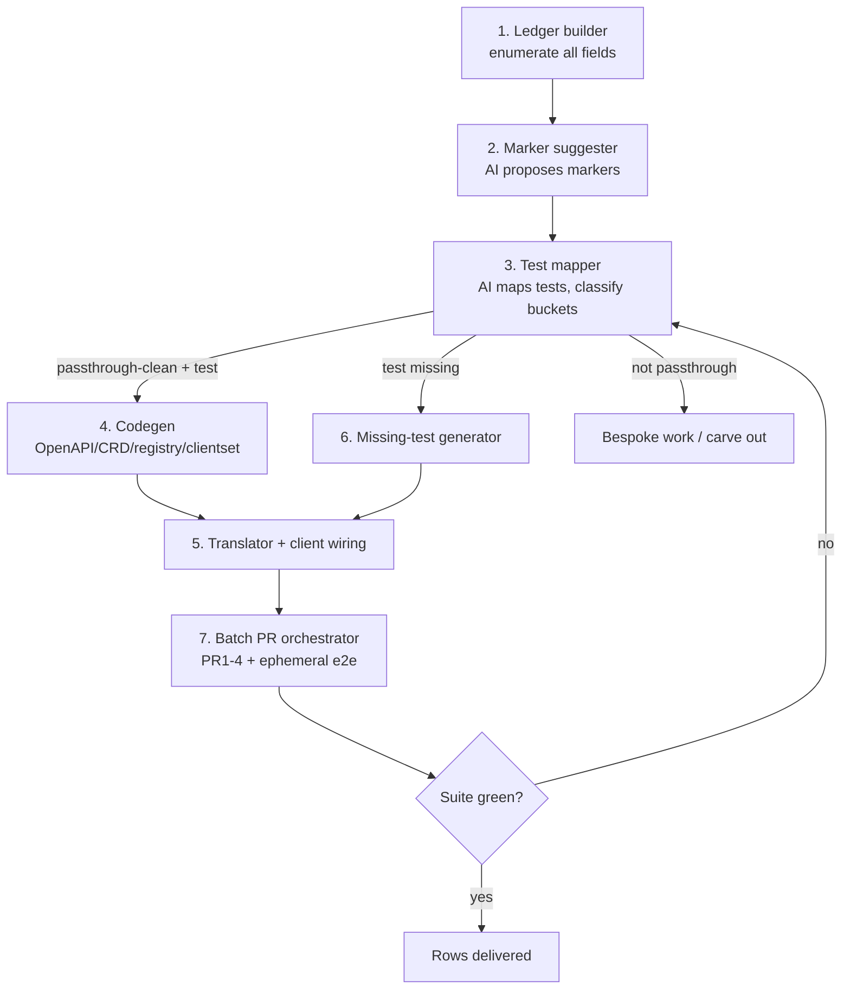

Plan: Accelerated delivery of V2 passthrough features

**Status:** Reviewed
**Parent Feature:** [ROSA-848](https://redhat.atlassian.net/browse/ROSA-848) "V2 SDK & Client Support (rosa, terraform, capa)"
**Authors:** Jaime, Guilherme, Chris (from brainstorm)

## TL;DR

We have to deliver ~70 `complexity:passthrough` + `ROSAHyperfleet:APIv1` features against the V2 Platform API. Instead of implementing them one at a time, we build a **pipeline that delivers the whole batch in one pass**, and we track the pipeline, not 70 tickets. The deliverable is the tool that delivers the features, run once.

## Why a new Epic (not a story)

`ROSA-848` is a Feature. It already has two child epics:

| Epic                                                               | Summary                            | Status      | Owner     |
| ------------------------------------------------------------------ | ---------------------------------- | ----------- | --------- |
| [ROSAENG-62084](https://redhat.atlassian.net/browse/ROSAENG-62084) | V2 SDK for Regional Platform API   | In Progress | Guilherme |
| [ROSAENG-65538](https://redhat.atlassian.net/browse/ROSAENG-65538) | Adopt v1 OIDC Config/Provider flow | Refinement  | Chris     |

No existing ticket captures this acceleration effort. It should be a **new Epic, sibling to ROSAENG-62084**, because:

- 70 features plus a repeatable pipeline is epic-scale, far too big for a story.
- ROSAENG-62084 is scoped as the **bootstrap** (its "Out of Scope" explicitly excludes full feature parity and CI). The 70 features are the scale-out phase that comes after it. Folding them in would blur that epic and make it un-closeable.
- This is a distinct theme: build the acceleration machine, then run the features through it.

## Core insight: one mapping, then batch delivery

A passthrough feature carries no bespoke logic. The field flows through. So per-feature cost should approach zero if generation and reuse do the work.

The accelerator is a **single source of truth produced once**: extend the **Field Registry into a delivery ledger**, one row per field, where each row ties together the field, its markers, the passthrough feature it belongs to, and the test that proves its behaviour.

| field path               | resource      | markers           | feature ref | test ref                  | status            |
| ------------------------ | ------------- | ----------------- | ----------- | ------------------------- | ----------------- |
| `HostedCluster.spec.foo` | HostedCluster | public, immutable | ROSA-xxxx   | `e2e/create_cluster: foo` | passthrough-clean |
| `NodePool.spec.bar`      | NodePool      | public, mutable   | ROSA-yyyy   | none                      | needs-test        |

Populate this once. After that everything is derived:

- `make generate` reads the **markers** column and emits OpenAPI + CRD + Field Registry + clientset for the whole set in one run.
- The **test ref** column says what proves each row's behaviour.
- Run the suite once. Green rows are delivered. Coverage is `rows delivered / total rows`.

The epic cannot be gamed: it is done when every registry row is either delivered-green or explicitly carved out. The ledger is the acceptance criteria.

### The mapping is a triage, not a lookup

Being honest about where "everything for free" holds. The single mapping pass sorts every field into one of three buckets. Only the first is free:

1. **passthrough-clean + test exists** &rarr; free. Generation plus one suite run delivers it. This is the bulk, and it is the real "in one go".
2. **passthrough-clean + test missing** &rarr; a test has to be written (positive plus negative/constraint). Real per-field work. The ledger's value is that it **counts** these on day one so the tail is known, not hidden.
3. **classified passthrough but actually isn't** &rarr; needs conversion, defaulting, or version-skew handling. Falls out of the batch into bespoke work. The mapping is where we discover these.

Three things sit outside the per-row model entirely and gate the whole batch:

- **Markers are a judgment call, not a copy.** `mutable`/`immutable` and especially `public` sometimes differ from HyperShift and need BU sign-off.
- **Cross-cutting gates:** versioning, authz, preflight/console access.
- **Per-client tail:** rosa CLI output formatting and terraform state, done once per client, not per feature.

So the precise claim: one mapping pass fans the bulk out mechanically **and** measures the residue exactly. "In one go" is true for bucket 1, and buckets 2 and 3 become a bounded, counted list on day one instead of an unknown.

## The tooling: what we build once (including optional AI)

### Design rule: AI only ever proposes into a verifier

Every AI output lands in front of an objective gate before it counts. Nothing AI produces ships unverified. That is what lets us trust a batch we did not hand-write:

- marker proposals &rarr; human + BU review, and generation must compile
- test mapping &rarr; deterministic static/dynamic confirmation
- command-to-SDK wiring &rarr; the reused v1 test passes or it does not
- generated tests &rarr; run in CI, fail closed

Deterministic wherever structure exists (codegen, enumeration). AI wherever the input is fuzzy natural language and the output is cheaply checkable (marker intent, test matching, code translation). Using AI for codegen that a generator does deterministically is the trap.

### Pipeline stages

| #   | Tool                                                                                                        | AI or deterministic               | Verified by                                      | Build status                                    |
| --- | ----------------------------------------------------------------------------------------------------------- | --------------------------------- | ------------------------------------------------ | ----------------------------------------------- |
| 1   | **Ledger builder**: walk HyperShift types/CRD, emit one registry row per field                              | Deterministic (AST/schema walk)   | Row count matches API; compiles                  | New, small                                      |
| 2   | **Marker suggester**: propose serviceset/mutable/immutable/public per field from godoc + sibling convention | AI                                | Human + BU review the table; generation compiles | New, optional AI, highest leverage              |
| 3   | **Test mapper/triager**: find the existing v1 test per field; classify the row into a bucket                | AI recall + deterministic confirm | Static ref check or instrumented run             | New, AI-assisted                                |
| 4   | **Codegen**: markers &rarr; OpenAPI + CRD + Field Registry + clientset                                      | Deterministic                     | Build + golden files                             | Mostly exists (passthrough-gen, conversion-gen) |
| 5   | **Command-to-SDK translator + client wiring**: CLI/v1-SDK invocation &rarr; v2 clientset calls              | AI drafts, hybrid                 | The reused v1 test is the oracle                 | New, AI high-leverage                           |
| 6   | **Missing-test generator**: draft positive + negative/constraint tests from the markers                     | AI drafts from the marker spec    | Runs in CI, fails closed                         | New, AI-assisted, handles the tail              |
| 7   | **Batch PR orchestrator**: open + chain PR1-4, wire ephemeral env, gate on CI                               | Deterministic automation          | CI + ephemeral e2e                               | Partly exists (Konflux renovate)                |

### Where the leverage is

- The **generation spine (stage 4) largely already exists** in the repos. The new build is stages 1, 2, 3, 5, 6, 7, and only 2, 3, 5, 6 want AI.
- **Invest AI at stage 2 first.** Markers gate everything downstream and are the biggest manual cost. A suggester that pre-fills every row with a proposed marker set, rationale, and confidence turns the review surface from 70 PRs into one spreadsheet where low-confidence rows self-flag.
- **Stage 3 is what makes "in one go" honest.** It counts the three buckets on day one.
- Leverage order: 2 &rarr; 3 &rarr; 5 &rarr; 6. Two AI tools (markers, test-mapping) unblock the deterministic bulk; two more (translation, test-gen) absorb the tail.

## Standardized delivery workflow (local ephemeral)

From the brainstorm, the per-batch rollout the orchestrator (stage 7) automates:

- **PR1 (hyperfleet-api):** update API and clientset SDK. Unit tests pass, on-demand-e2e clean.
- Local ephemeral env points hyperfleet at locally built API images (not merged).
- **PR2 (hyperfleet):** bump Konflux-built API images, rolls out to integration and staging.
- **PR3 (rosa CLI):** update CLI and e2e tests.
- **PR4 (terraform):** update provider and e2e tests.
- Konflux renovate auto-bumps downstream on change. Integration and stage promotion gate the client PRs.

## Proposed Jira epic

**Issue type:** Epic
**Project:** ROSAENG &middot; **Parent (Feature):** ROSA-848
**Team:** [ROSA] HyperFleet (`customfield_10001` = `0c538cd9-152b-49f6-ad7c-e2fa2f865809`)
**Relates to:** ROSAENG-62084 (V2 SDK bootstrap)

**Summary:** Accelerated delivery of V2 passthrough features (pipeline + ~70 features)

**Proposed stories:**

- Build the Field Registry delivery ledger (schema) and populate it in one pass (stages 1 + 2).
- Build the test mapper/triager; produce the three-bucket classification (stage 3).
- Wire the marker-driven generation over the full set (stage 4).
- Build the command-to-SDK translator and client wiring (stage 5).
- Build the missing-test generator (stage 6).
- Build the batch PR orchestrator (stage 7).
- Run the batch and validate against the existing suite.
- Tail stories, created **after** the mapping exists (missing tests, non-passthrough exceptions), because they cannot be enumerated before.
- Horizontal gates: versioning, authz, preflight/console (some may already exist under ROSAENG-62084).

## Scope notes

- **CAPA:** in scope for the effort but likely a **second pass** after rosa CLI and terraform. Sequencing TBD.
- **Out of scope:** V2 SDK bootstrap and initial client wiring (covered by ROSAENG-62084).

## Open questions

- Do we adopt TDD for the missing-test cases?
- Does this intersect with Progressive Delivery?

## References

- Passthrough feature query: `labels = complexity:passthrough and labels = ROSAHyperfleet:APIv1 and status != Closed`
- JIRA-to-ROSA-CLI test-case mapping spreadsheet
