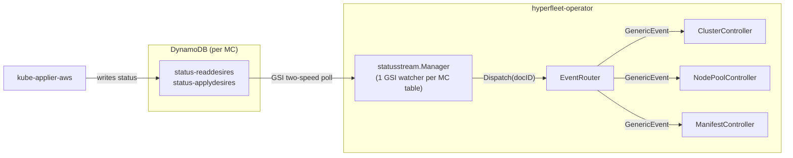

# DynamoDB Status Distribution

How DynamoDB status updates reach the right controller.

## Overview



## Event flow

1. **kube-applier-aws** applies/deletes/reads resources on a management cluster and writes the result to the MC's DynamoDB status tables.

2. **statusstream.Manager** runs one `hyperfleet-dynamo` `Watcher` goroutine per MC per status table suffix. Each watcher runs a two-speed engine: a fast GSI poll (default 15 s) for low-latency change detection, and a full consistent relist (default 5 m) for deletion detection and correctness. When a changed `documentID` is detected, the watcher calls `EventRouter.Dispatch(docID)`.

3. **EventRouter** is a shared in-memory index mapping `documentID → {channel, CR key}`. On dispatch, it looks up the document ID and sends a `GenericEvent` into the target controller's `StatusEvents` channel (non-blocking — drops if full).

4. **Controller** receives the `GenericEvent` via `WatchesRawSource(source.Channel(...))` in `SetupWithManager`, which enqueues a reconcile for the CR. The reconcile calls `GetDesireStatus` to read the current status from DynamoDB with a consistent read.

## Registration

Controllers register their document IDs with the EventRouter during reconciliation, after upserting desires:

```go
r.EventRouter.Register(docID, EventTarget{
    Channel: r.StatusEvents,
    Key:     req.NamespacedName,
})
```

On deletion, controllers deregister to stop receiving events:

```go
r.EventRouter.Deregister(docID)
```

Each controller type has its own `StatusEvents` channel (buffered, capacity 256). All controllers share one `EventRouter` instance.

## Replica scaling

The GSI polling approach has no consumer limit. Unlike DynamoDB Streams (which was capped at 2 concurrent consumers per shard), each `Watcher` goroutine queries the `updateTime-index` GSI independently. The operator can scale to any number of replicas without risk of throttling or missed events on the status path.

## Reliability

The watcher is a low-latency optimization, not the consistency guarantee. Events can be missed in edge cases:

- **Channel full**: `EventRouter.Dispatch` is non-blocking. If a controller's channel (capacity 256) is full, the event is dropped.
- **Registration race**: A status update can arrive before the controller has registered its document ID with EventRouter.

None of these cause permanent state loss. Every successful reconcile returns `RequeueAfter: 5m` as a safety net — the controller re-reads status directly from DynamoDB. Active waiting states (no placement yet, delete pending) use `RequeueAfter: 5s`. So a missed poll event delays the reaction by at most 5 minutes; it doesn't lose state.

Deletions from the status tables are detected by the full relist (5 m) rather than the fast poll. The watcher calls `OnChange(docID, nil)` when an item disappears.

## Writing and reading specs

Use `UpsertApplyDesire` or `UpsertReadDesire` to write specs. The DynamoDB client keeps an in-memory hash cache per desire — if the spec hasn't changed, the write is skipped entirely (no DynamoDB call). Use `DeleteDesireSpec` to remove a spec row.

Deletion of a Kubernetes resource is expressed as an `ApplyDesire` with `spec.type=Delete` — there is no separate `DeleteDesire` type or `deletedesires` table.

Use `GetApplyDesireStatus` / `GetReadDesireStatus` for consistent reads. Use `CheckApplyDesireStatuses` to check whether kube-applier has processed your specs — these compare `ObservedDesireUpdateTime` against the spec's `updateTime` to ignore stale statuses.
