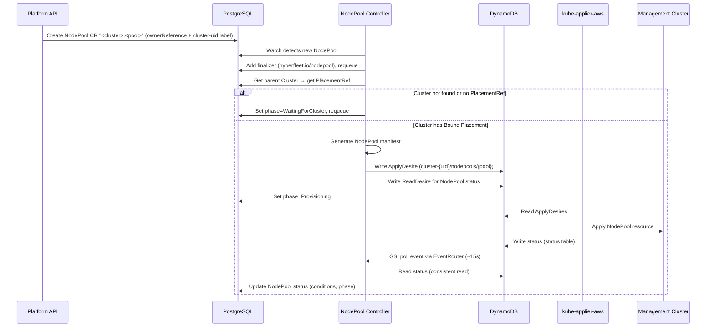
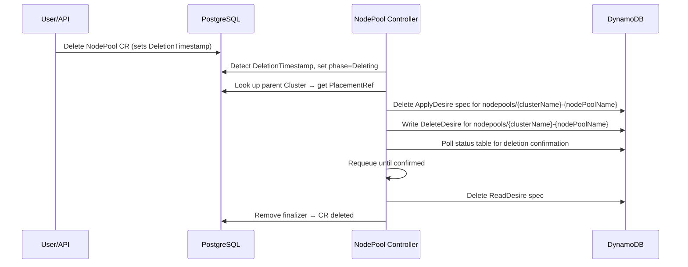

# NodePool Controller

## Creation Flow

### Reconcile Steps

1. **Finalizer**: Adds `hyperfleet.io/nodepool` finalizer on first reconcile, requeues
2. **Parent Cluster lookup**: Gets the Cluster named in the controller ownerReference (same account namespace) and checks its uid; waits if it is missing, its name now belongs to a different cluster, or it has no `PlacementRef`. On deletion, a missing owner means the pool is an orphan: it cleans up what it can and removes its finalizer
3. **Manifest generation**: Generates a HyperShift NodePool manifest
4. **ApplyDesire**: Writes one ApplyDesire to `{mc}-specs-applydesires`
5. **ReadDesire**: Creates a ReadDesire for the NodePool to get status feedback (extracts "Ready" condition from the remote NodePool)
6. **Status propagation**: Reads status from DynamoDB, updates NodePool CR conditions (Synced, Ready) and phase
7. **Requeue**: Requeues every 5 minutes as a fallback; GSI two-speed polling via EventRouter provides the primary notification path (~15s latency)

### Generated Resource

The NodePool CR is named `{clusterName}.{pool}`; on the MC only the child part is
used: the manifest is named `{pool}` and lives in the cluster's namespace `cluster-{uid}`.

| Resource              | Name                           | Purpose                                   |
| --------------------- | ------------------------------ | ----------------------------------------- |
| NodePool (HyperShift) | `{clusterName}-{nodePoolName}` | Worker node set on the management cluster |

## Deletion Flow

When a NodePool is deleted (either standalone or as part of Cluster cascade deletion):

### Deletion Steps

1. **PlacementRef lookup**: Gets the parent Cluster's PlacementRef to determine the target MC
2. **ApplyDesire cleanup**: Deletes the ApplyDesire spec from DynamoDB before writing the DeleteDesire, preventing kube-applier from racing and re-applying the resource being deleted
3. **DeleteDesire**: Writes a DeleteDesire for the NodePool resource on the MC
4. **Confirmation**: Polls `{mc}-status-deletedesires` until kube-applier-aws confirms the deletion
5. **ReadDesire cleanup**: Deletes the ReadDesire spec from DynamoDB
6. **Finalizer removal**: Removes finalizer, allowing the CR to be garbage-collected

The parent Cluster and Placement are unaffected by standalone NodePool deletion.
