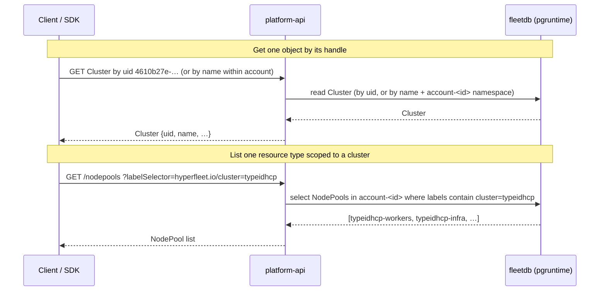
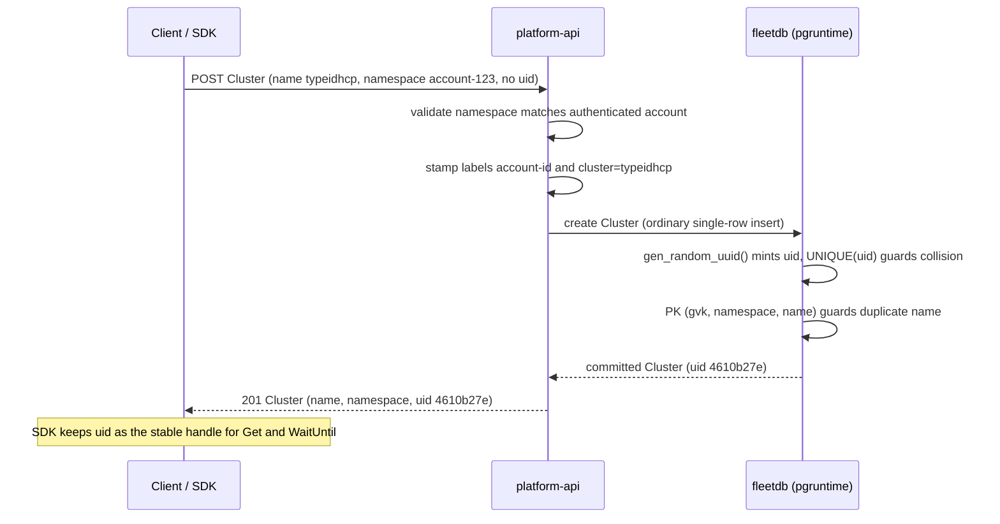

# Resource Identity & Uniqueness Model

> This is the single source of truth for the identity, namespace, and uniqueness
> model of user-created HyperFleet resources. New and reviewed code must follow it.
> The [Implementation plan](#implementation-plan) is the PR breakdown for the
> refactor epic and will be removed after the implementation is done.

## Overview

User-created resources follow native Kubernetes object semantics: the API consumer
(the SDK) supplies the **name** and **namespace**, the server assigns the opaque
**uid**, and uniqueness is the database's job wherever a primary key can do it. The
platform-api is a thin passthrough — it stores what the client sends and decides as
little as possible — so the customer gets a `kubectl`-like experience.

The points below are guidelines for anyone writing or reviewing code that creates,
names, or namespaces user-facing resources.

- **Namespace** `metadata.namespace = account-<id>` — passthrough field set by the API
  caller; tenant resources live in their account-id namespace. (Internal resources
  created by controllers aren't tenant-scoped and may be cluster-scoped.)
- **Name** `metadata.name` — passthrough field set by the API caller.
- **Tenant isolation** — the `account-<id>` namespace scopes resources by tenant, and
  authz at the platform-api layer grants each caller their permissions only within their
  own account namespace.
- **UID** `metadata.uid` — the object's own DB-assigned UUID. On a Cluster it is the
  **cluster ID**.
- **Immutability** — `namespace`, `name`, and `uid` are immutable after object create.
- **Labels are platform-owned.** `hyperfleet.io/account-id` and `hyperfleet.io/cluster`
  (the cluster name) are stamped by platform-api at create, immutable, and **read-only**
  in the public API. Clients query by them through the `labelSelector` request parameter.
  Because the label key set is service-set and bounded, labels can be **indexed** (a GIN
  index over the labels map, or per-key expression indexes) so selector LISTs and
  [sharding](#sharding) stay index-only.
- **Annotations are the customer's.** Free-form `metadata.annotations` are passthrough —
  stored verbatim, never indexed or selectable. Passthrough still means validated:
  platform-api checks key format and total size.
- **Uniqueness** — the DB primary key `(gvk, namespace, name)` for names (synchronous
  `AlreadyExists`); the controller-owned `Index` primitive for cross-cutting
  reservations, cleaned up by the creator.

## Resource identity

A Cluster and one of its NodePools, **as stored in fleetdb**. Comments mark fields
present on every stored object and who maintains them.

```yaml
apiVersion: hyperfleet.io/v1alpha1
kind: Cluster
metadata:
  name: typeidhcp # client-supplied; immutable; RFC 1123 (always present)
  namespace: account-123456789012 # client-supplied = account-<id>; API-validated (always present)
  uid: 4610b27e-8f77-4f4c-9661-c11b42e04dec # DB-assigned at create (gen_random_uuid); = cluster ID (always present)
  labels: # platform-owned; read-only in the public API (returned, not settable)
    hyperfleet.io/account-id: "123456789012" # stamped by platform-api; on account-scoped resources
    hyperfleet.io/cluster: typeidhcp # own name; shard + lookup key; on cluster-bound resources
spec: {} # cluster configuration (networking, IAM, OIDC issuer, …)
```

```yaml
apiVersion: hyperfleet.io/v1alpha1
kind: NodePool
metadata:
  name: typeidhcp-workers # SDK-composed {clusterName}-{poolName}; immutable (always present)
  namespace: account-123456789012 # same account-<id> as its parent (always present)
  uid: 9c2f5e1a-1b2c-4d3e-8f90-a1b2c3d4e5f6 # the NodePool's own DB-assigned uid (always present)
  labels: # platform-owned; read-only in the public API (returned, not settable)
    hyperfleet.io/account-id: "123456789012" # stamped by platform-api; on account-scoped resources
    hyperfleet.io/cluster: typeidhcp # parent cluster name (= spec.clusterRef); shard + lookup key
spec:
  clusterRef: typeidhcp # parent Cluster's metadata.name (always present)
  # … node pool configuration
```

| Field                              | Value          | Set by                 | Properties                                                                                  |
| ---------------------------------- | -------------- | ---------------------- | ------------------------------------------------------------------------------------------- |
| `metadata.namespace`               | `account-<id>` | client (SDK)           | tenancy; API validates `== authenticated account`                                           |
| `metadata.name`                    | `typeidhcp`    | client (SDK)           | immutable, PK-unique per account (format below)                                             |
| `metadata.uid`                     | UUID           | DB (`gen_random_uuid`) | the object's own id; on a Cluster = cluster ID                                              |
| `labels[hyperfleet.io/account-id]` | `123456789012` | platform-api (create)  | selectable; immutable                                                                       |
| `labels[hyperfleet.io/cluster]`    | cluster name   | platform-api (create)  | own name on the Cluster, parent name on children; shard + lookup key; selectable; immutable |
| `metadata.labels`                  | —              | platform-api           | read-only in the public API: returned on reads, ignored on write                            |
| `metadata.annotations`             | any            | client (SDK)           | free-form passthrough; not indexed, not selectable                                          |

## Lookup & lifecycle (SDK)

Every operation is by `metadata.name` within the account namespace or by the
`metadata.uid` handle; the belongs-to labels make cross-cutting lists cheap.

- **Create** — for every resource the client sends name + namespace and no uid; the
  server assigns and returns the uid. On a Cluster that uid is the load-bearing cluster
  handle — see [Cluster create](#cluster-create); on a child it is just
  the object's own id, addressed by its composed name.
- **Get** — name is the first-class address: a direct PK `Get` within `account-<id>`.
  uid lookup (ROSA-classic-style `GET /clusters/{id}`) needs no extra machinery — it's a
  `List(namespace=account-<id>, MatchingFields{"metadata.uid": <uid>})`, which pushes the
  predicate into SQL. One prerequisite: map `metadata.uid` to the real `uid` **column** in
  `fieldselector.go` (a one-line `case`), since it currently falls through to the JSONB
  `metadata->>'uid'`, which isn't the authoritative DB-assigned uid. Because the model adds
  `UNIQUE(uid)` (see [Uniqueness](#uniqueness)), the field selector resolves to a single-row
  indexed lookup, not a namespace scan.
- **List a kind, scoped to a cluster** —
  `GET /nodepools?labelSelector=hyperfleet.io/cluster=<name>`. The name is unambiguous
  because the query is already account-scoped.
- **List a kind, scoped to an account** —
  `GET /nodepools?labelSelector=hyperfleet.io/account-id=<id>`.
- **Update** — mutate spec by name or uid. `namespace`, `name`, `uid`, and the
  belongs-to labels are immutable and rejected if changed; concurrency is optimistic
  (object version).
- **Delete** — by name or uid. Deleting a **Cluster** cascades to its children (by
  `hyperfleet.io/cluster` label / `spec.clusterRef`), each removed behind its finalizer;
  deleting a **child** is independent.



## Validation

Every rule is checked explicitly at a defined layer. "Passthrough" means the API
stores what the client sends unchanged — not that it skips validation.

| Input                    | Rule                                           | Enforced by                      | On violation                       |
| ------------------------ | ---------------------------------------------- | -------------------------------- | ---------------------------------- |
| `metadata.namespace`     | equals `account-<authenticated account>`       | platform-api                     | reject (403)                       |
| `metadata.name`          | valid RFC 1123 DNS name; required              | platform-api                     | reject (400)                       |
| `metadata.name` (update) | immutable                                      | platform-api                     | reject                             |
| `metadata.uid`           | server-assigned; client-supplied value ignored | fleetdb (column default)         | ignored / overwritten              |
| `uid` uniqueness         | each `uid` globally unique                     | fleetdb `UNIQUE(uid)` constraint | conflict → retry                   |
| name uniqueness          | one `metadata.name` per `(gvk, account-<id>)`  | fleetdb primary key              | `AlreadyExists` (409)              |
| `metadata.labels`        | read-only; platform-set                        | public API (ignored on write)    | ignored                            |
| `metadata.annotations`   | valid key format; size cap                     | platform-api                     | reject (400)                       |
| `Index` reservation      | one holder per `(namespace, reserved value)`   | fleetdb primary key (controller) | `AlreadyExists` → controller retry |

> **What "enforced by" means here.** fleetdb is **not** a Kubernetes apiserver — its
> write path stores JSONB and runs **no admission or schema validation**. It enforces
> only the primary key and column constraints (the `uid` default, `NOT NULL`). So
> _structural_ guarantees (name uniqueness, server-assigned uid) come from fleetdb,
> while _semantic_ validation (namespace match, name format, immutability) lives in
> **platform-api** today. The CRD OpenAPI/CEL markers are authored on the types but do
> **not** enforce anything until CRD-level validation is wired into the write path — a
> planned future capability. Until then, treat platform-api as the only enforcement
> point for the semantic rules, and do not rely on the CRD schema to reject bad input.

**RFC 1123 name** ("DNS-safe"): lowercase letters, digits, and `-`, starting and
ending with an alphanumeric (e.g. `typeidhcp`, `prod-us-east`; not `My_Cluster`). It
matches the contract Kubernetes applies to object names, and the CRD schema will encode
it once CRD validation is enforced. Renaming is delete + recreate.

> **Open item — name length.** A DNS _subdomain_ allows 253 chars, but a Cluster name
> embedded in hostnames (`api.{name}.{prefix}.{shard}.{baseDomain}`) must be a
> ≤63-char DNS _label_. Confirm the bound per resource (Cluster likely 63) and where it
> is enforced (CRD CEL marker vs. platform-api). The old namespace-fit cap
> (`MaxClusterNameLen`) is gone.

## Uniqueness

- **Per-account name uniqueness** — DB primary key `(gvk, namespace, name)`.
  Synchronous, free, no extra objects. For a Cluster the `name` is the customer's
  cluster name. For a NodePool the `name` is the SDK-composed `{clusterName}-{poolName}` —
  the **same string** the operator renders onto the HCP as the HyperShift NodePool name.
- **NodePool composed-name — collision risk.** The single-`-` join is **not injective**:
  `prod-us` + `east` and `prod` + `us-east` both yield `prod-us-east`, so two distinct
  (cluster, pool) pairs in one account can hit the same PK and the later create fails with
  a spurious `AlreadyExists`. **Open question for SDK dev:** how to disambiguate the
  composition (delimiter, validation, or accept as low-probability).
- **`Index` for cross-cutting reservations** — `Index` (`api/v1alpha1/index_types.go`)
  is a generic primitive: an empty spec whose meaning is carried by `(namespace, name)`,
  enforced by the same PK. The namespace selects the scope (a global domain vs
  `account-<id>`). Use it whenever a value must be unique across a scope that the native
  per-account name PK doesn't cover — e.g. a DNS prefix or an OIDC issuer URL, each
  reserved in a global domain. All `Index` objects are controller-owned and
  finalizer-cleaned.
- **Cluster `uid` is the exception — a `UNIQUE(uid)` column, not an `Index`.** An `Index`
  reserves a **client-chosen** value with **no native column** in a **global** domain. The
  `uid` is **server-minted** and already its own `uid` column, so `UNIQUE(uid)` enforces it
  inline on the insert — a safety net against an unlikely collision, not a value clients
  race for. See
  [Guaranteeing cluster `uid` uniqueness](#guaranteeing-cluster-uid-uniqueness).

## Sharding

**How it works.** Each StatefulSet replica owns one shard — its pod ordinal
(`Mod = replicaCount`, `Owned = [ordinal]`, `cmd/manager/main.go`). There is no leader
election; every replica is active on its own slice, which is how the region scales
horizontally.

**What the shard bounds.** The change doorbell is one content-free `pg_notify` _per GVK_, so
any write wakes every replica. The shard predicate on the follow-up poll
(`internal/reader/shard.go`) is the only thing that narrows a replica down to its slice. It
bounds two things — and nothing else:

- **Informer cache** — without it, every replica caches the whole region.
- **Reconciles** — without it, every replica reconciles every object.

Reads are never sharded: the direct client sees everything, so any replica can point-query
any row.

**Shard key.** `namespace` + the `hyperfleet.io/cluster` label — `hashtext(namespace || '/' || cluster)`.
One expression covers every GVK, degrading gracefully:

- **Cluster label present** → shard **per cluster**, so one whale tenant's clusters spread
  across replicas instead of piling onto one shard. That label is the cluster's **name**
  (the parent name on children) — client-supplied, set at create and immutable, so a row
  never changes shard.
- **Cluster label absent** (`COALESCE(..., '')`) → shard **by namespace** — the account
  namespace for user resources, the reservation/MC namespace otherwise.

We key on `namespace`, **not** an `account-id` label, on purpose: the namespace is
`account-<id>` for every user resource, so it already encodes the account (a second label
would be redundant); and unlike the label it is present on **every** row, so label-less
rows still distribute instead of all hashing to one shard. An expression index keeps the
poll index-only (replacing today's `hashtext(namespace)`, `sharding.md`):

```sql
CREATE INDEX idx_kr_cluster_shard ON kubernetes_resources
  (abs(hashtext(namespace || '/' || COALESCE(metadata->'labels'->>'hyperfleet.io/cluster', ''))::bigint));
```

**Unsharded GVKs.** `UnshardedGVK` (`cmd/manager/main.go`) affects only the _informer/watch_
stream: it makes every replica watch the complete set instead of its shard. Use it when a
controller must **watch** a complete, low-cardinality, cross-cutting set — one where a change
to any object must re-trigger reconciles on every replica. It is _not_ needed to merely read
cross-shard data: reads go through the unsharded direct client, so any replica already sees
every row.

**Is it worth it?** Sharding is an early, in-place answer to _eventual_ horizontal scale —
arguably over-engineering today. It runs single-shard (`Mod = 1`), where CR's leader election
is equally correct and simpler but caps the region at one replica (vertical scale only). We
keep it so growth is a knob (`REPLICA_COUNT`), not a re-architecture.

**Why not controller-runtime's built-in sharding?** It has none that fits. Its one native
cache-partitioning primitive — selector-scoped informers (`cache.Options`) — fails us twice:

- **Unreachable.** That primitive lives in CR's apiserver-backed cache. We have no apiserver
  (`pgManager.GetConfig()` panics), so we re-implement `cache.Cache` as `pgCache` and the
  ListWatch hits SQL directly.
- **Too weak.** Label selectors do equality/set matching only — they can't express
  `hash % Mod` without stamping a shard-number label on every object and relabel-storming to
  rebalance. Our SQL predicate computes membership from an existing label and rebalances by
  changing params.

CR's programming model stays intact — `pgCache` is a real `cache.Cache`; only the cache
backend changed.

## Guaranteeing cluster `uid` uniqueness

`uid` is a random UUIDv4, so it is globally unique **by construction** — the same bet
Kubernetes makes. Enforcing it matters only because the **cluster `uid` is
load-bearing**: the operator derives the MC control-plane namespace (`clusters-{uid}`)
from it, so a collision would map two hosted control planes to one namespace — a
**catastrophic, silent** failure without enforcement, a **loud, recoverable** one with it.

Three concerns are independent — don't conflate them:

- **Uniqueness** — a `UNIQUE(uid)` column constraint. The ordinary single-row insert
  fails inline on the (astronomically unlikely) collision; the create retries and
  `gen_random_uuid()` re-mints. No extra objects, no transaction gymnastics.
- **Sharding** — the shard key is the `hyperfleet.io/cluster` label, whose value is the
  client-supplied **name** (see [Sharding](#sharding)). The name is known before the
  write, so the API stamps it on the ordinary insert — the uid is never needed as a label.
- **Lookup** — get-by-uid is always the `metadata.uid` field selector pushed into SQL
  (see [Get](#lookup--lifecycle-sdk)); it does **not** depend on the uniqueness or label
  choice.

**Go-to — ordinary single-row create, `UNIQUE(uid)`, name shard label.** Because the shard
label is the name (not the DB-minted uid), a Cluster create is an ordinary single-row
`INSERT` like every other resource — no start-commit, no read-back. `gen_random_uuid()`
mints the uid, `UNIQUE(uid)` catches a collision inline (retry re-mints), and platform-api
stamps `hyperfleet.io/cluster=<name>` from data it already holds. See
[Alternatives](#alternatives) for the uid-as-label variants and why we don't need them.

### Cluster create

Creating a **Cluster** is an ordinary single-row create, identical to every other
resource: the client sends name + `account-<id>` namespace and no uid; fleetdb mints the
uid (`gen_random_uuid()`), the PK `(gvk, namespace, name)` guarantees per-account name
uniqueness and `UNIQUE(uid)` guards the uid, and platform-api stamps
`hyperfleet.io/account-id` and `hyperfleet.io/cluster=<name>` before the write. Children
are the same: they arrive with `hyperfleet.io/cluster=<parent name>` (the API reads the
parent from `spec.clusterRef`), and every cross-cutting reservation uses the generic
`Index` primitive.



### Alternatives

Lookup is the same in every row (`metadata.uid` field selector), so it doesn't drive the
choice. The trade-off is **create-path simplicity vs. carrying the uid in the shard
label**: whether the shard label is the client-supplied name (ordinary single-row insert)
or the DB-minted uid (needs a start-commit to read the uid back and stamp it).

| Approach                                                   | Uniqueness                                  | Sharding label                                        | Lookup                        | Create path / cost                                                           |
| ---------------------------------------------------------- | ------------------------------------------- | ----------------------------------------------------- | ----------------------------- | ---------------------------------------------------------------------------- |
| **Go-to** — single-row create + `UNIQUE(uid)` + name label | `UNIQUE(uid)` constraint; collision → retry | name — **the user** writes it; kube-native            | `metadata.uid` field selector | simplest: single-row `INSERT`, labels stamped from known data                |
| **uid label** — start-commit + `UNIQUE(uid)` + uid label   | `UNIQUE(uid)` constraint; collision → retry | uid — **we** stamp it (start-commit); not kube-native | same                          | multi-row start-commit (`INSERT ... RETURNING uid`, then set the label)      |
| **uid Index** — start-commit + uid `Index` + uid label     | uid `Index` PK, co-committed in the tx      | uid — **we** stamp it (start-commit); not kube-native | same                          | start-commit + one `Index` row + finalizer per cluster; schema stays generic |

The **go-to** is the most Kubernetes-native: the shard label is just the client-supplied
**name**, set on an ordinary single-row create like any kube label — no start-commit, no
minting. The uid still comes back on the create response and stays the load-bearing handle;
it simply isn't a label. The **uid-label** variants exist only if we ever want the shard key
to be the uid — they differ only in _where_ uid uniqueness lives (a schema constraint vs. an
extra `Index` row), and both pay for a bespoke start-commit that stamps a server-minted value
into a label the client never set. We don't need that today.

---

## Today's gaps vs this model

Greenfield, so these are a clean cutover, not migrations. What `main` does today vs the
model above — the PRs below close each gap in order:

| Area           | Today                                                                                                                                             | Target                                                                               |
| -------------- | ------------------------------------------------------------------------------------------------------------------------------------------------- | ------------------------------------------------------------------------------------ |
| Namespace      | API-computed `cluster-<uuid>` (`convert.go`, `clusterNamespace`)                                                                                  | client `account-<id>` passthrough                                                    |
| Name           | server-minted UUID (`generateID()`)                                                                                                               | client-supplied RFC 1123 name                                                        |
| uid            | re-derived from the namespace on read (`convert.go`); column default only, **no `UNIQUE`** (`001_initial.sql`)                                    | real DB `uid`, `UNIQUE(uid)`, surfaced on create                                     |
| Cluster lookup | `List(namespace=cluster-<id>, label=account)` — leans on id-in-namespace; `metadata.uid` maps to JSONB, not the `uid` column (`fieldselector.go`) | `metadata.uid` field selector on the real column, scoped to `account-<id>`           |
| Cluster create | single-row `writer.Write` (`pgclient.go`)                                                                                                         | unchanged single-row create; add `UNIQUE(uid)`; stamp `hyperfleet.io/cluster=<name>` |
| Belongs-to     | only `hyperfleet.io/account-id` stamped                                                                                                           | `hyperfleet.io/cluster` on Cluster + children; labels read-only in the API           |
| Sharding       | `hashtext(namespace)` (`shard.go`), no cluster-label index                                                                                        | per-cluster on the `hyperfleet.io/cluster` label + `idx_kr_cluster_shard`            |
| NodePool       | namespace = `cluster-<id>`                                                                                                                        | `account-<id>`, name `{clusterName}-{poolName}`, parent via `spec.clusterRef`        |
| `Index`        | in use for DNS + OIDC reservations                                                                                                                | unchanged — the reservation primitive for everything non-Cluster                     |

---

## Implementation plan

PR-sized chunks for the refactor epic. Each PR is self-contained, independently
reviewable, and leaves `main` building and green (`make verify && make test`), and
ships the doc updates for the behavior it changes in the same PR. Greenfield — no
existing clusters or data — so this is a clean cutover with **no back-compat shims or
migrations**.

### PR 1 — fleetdb: confirm DB-assigned `uid` surfaces on create

_Foundation. Additive and backward-compatible._

- Confirm `metadata.uid` is DB-assigned (`gen_random_uuid()`) and **returned** on the
  create path across both the stored-proc and multi-statement paths
  (`internal/writer/writer.go`, `internal/schema/migrations/*.sql`); add coverage if a
  path drops it. Mostly verification/hardening — the column default already mints it.
- Sharding untouched here (the switch is PR 4).
- Add the `UNIQUE(uid)` constraint (`internal/schema/migrations/*.sql`); the Cluster
  create stays an ordinary single-row insert — no start-commit, since the shard label is
  the client-supplied name, not the DB-minted uid (see [Alternatives](#alternatives)).
- Tests: create returns a stable non-nil `uid`; explicit client-supplied uid is ignored.

**Why it stands alone:** no consumer changes required; it pins down behavior the epic
relies on.

### PR 2 — Identity flip: passthrough namespace, client-supplied name, server uid

_The core behavioral change. Cross-module by necessity (the `api/` contract is shared by
platform-api and the operator), done in one PR so `main` never sees a half-flipped
model._

- **api/v1alpha1**: update `cluster_types.go` / `nodepool_types.go` doc comments
  (namespace `account-<id>`, `metadata.name` = client-supplied name, `uid` = handle);
  **add the `spec.clusterRef` field** (parent cluster name) to `nodepool_types.go` — the
  parent link the operator resolves against, now that NodePools no longer live in the
  parent's namespace; add RFC 1123 name validation markers; regenerate CRDs, deepcopy,
  clientset, OpenAPI, conversion (`make generate`).
- **platform-api**: delete API-side namespace computation (`enrichMetadata` namespace
  assignment, `ClusterNSPrefix`, `MaxClusterNameLen`, `clusterNamespace`,
  `ClusterIDFromNamespace` in `pkg/clients/hyperfleetdb/convert.go`); accept and
  **validate** `metadata.namespace == account-<authenticatedAccount>`; store
  `metadata.name` verbatim; drop `generateID()` name-minting (fleetdb assigns and
  returns `uid` — return name+uid to the caller); remove the `pub.UID` overrides in
  `convert.go` (`InternalToPublicCluster` namespace-derived, `InternalToPublicNodePool`
  `cr.Name`) so the real `uid` surfaces; support `GET` by name (within account) and by
  uid; drop the legacy namespace validation in `pkg/handlers/nodepool.go` and create
  NodePools in `account-<id>` with `spec.clusterRef` = cluster name.
- **hyperfleet-operator**: derive identity from `metadata.name` / `metadata.uid` instead
  of the namespace; delete the `cluster-` strip helpers (`internal/render/types.go`);
  render user resources under `account-<id>`; derive MC-side namespaces from the cluster
  `uid`; **resolve a NodePool's parent via `spec.clusterRef`** (replacing the old
  `InNamespace(cluster-<id>)` lookup); keep DNS/OIDC Index flows controller-owned.
- **Docs**: update the controller docs this flip touches — `architecture.md` (CRD
  namespace/name/uid), `cluster-controller.md` (naming + MC-side namespace from `uid`),
  `nodepool-controller.md` (MC-side namespace) — and add pointers to this doc.
- **Tests**: move controller/handler tests to `account-<id>` namespaces with
  client-supplied names + server `uid`; add namespace-mismatch rejection and
  duplicate-name `AlreadyExists`.

**Why it stands alone:** the complete cutover — producer and consumer move together, so
`make test-integration` stays green. Splitting further would need a dual-read shim,
against the clean-cutover goal.

### PR 3 — Belongs-to labels, reservations, and NodePool uniqueness

_Independent follow-up on the flipped model._

- Stamp the `hyperfleet.io/cluster` label (the cluster name) at create in platform-api —
  own name on the Cluster, parent name (from `spec.clusterRef`) on children — and keep
  `hyperfleet.io/account-id`; add `LIST` by `hyperfleet.io/{cluster,account-id}` in
  platform-api. No operator backfill: the label is present at create.
- Make labels platform-owned and **read-only in the public API**: return them on reads
  but ignore any client-supplied `metadata.labels` on write (same pattern as `uid`);
  expose `metadata.annotations` as the client's free-form passthrough. Support the
  `labelSelector` request parameter for the `LIST` selectors, and add the index that
  backs them — a GIN index over the labels map is fine since labels are service-set and
  bounded (or per-key expression indexes for `hyperfleet.io/{account-id,cluster}`).
- Implement cluster-scoped NodePool naming: SDK composes `{clusterName}-{poolName}`;
  platform-api stores verbatim. (The `spec.clusterRef` field and the operator's
  parent-resolution against it land in PR 2; this PR only adds the composed-name rule.)
- Move any remaining reservation into reconcile, finalizer-cleaned. No uid `Index`: the
  cluster `uid` is guarded by `UNIQUE(uid)`, not a reservation (see
  [Uniqueness](#uniqueness)).
- Round-trip tests for `clusterRef` resolution and label selection.
- **Docs**: update `cluster-controller.md` (DNS-reservation) and
  `nodepool-controller.md` (naming/uniqueness).

**Why it stands alone:** each item is additive on the PR-2 model and independently
testable.

### PR 4 — Per-cluster sharding on the `hyperfleet.io/cluster` label

_Switches the shard key from namespace to the cluster label. Depends on PR 3, which
guarantees the label is present at create._

- Change the shard clause in `internal/reader/shard.go` from `hashtext(namespace)` to
  the cluster-label key defined in [Sharding](#sharding); keep `ManagementCluster` on
  the `UnshardedGVK` list (`cmd/manager/main.go`).
- Add the matching expression index in a migration
  (`hyperfleet-db/internal/schema/migrations/*.sql`) so the poll stays index-only.
- Keep the `CLAUDE.md` "Resource identity & uniqueness" rule in sync (already added);
  confirm reviewing agents flag any regression to an identity-encoding namespace or a
  mutable shard key.
- Tests: a cluster's Cluster + children land on one shard; two clusters in one account
  spread across shards; label-less resources shard by namespace; MC visible on every
  replica.
- **Docs**: update `sharding.md` and `architecture.md` (§ Horizontal Scaling).

**Why it stands alone:** the label already exists (PR 3), so this is a localized reader +
migration change with its own multi-replica tests.
